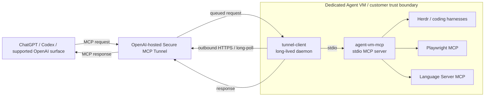
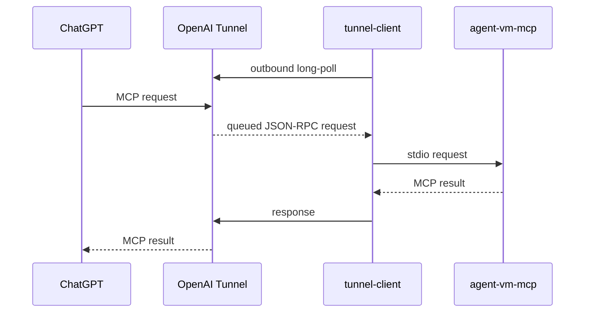
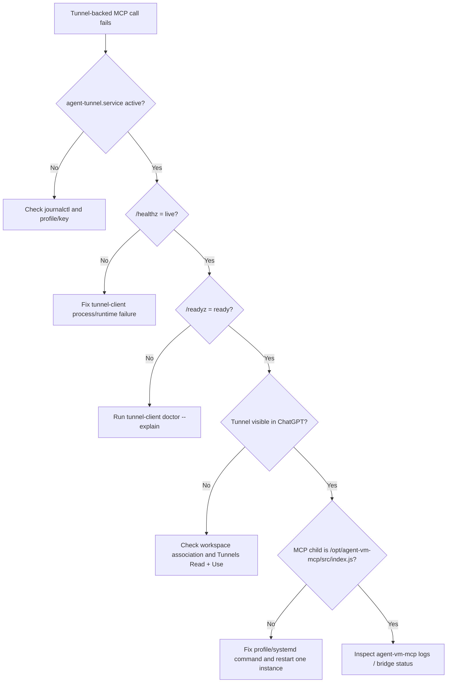

# Connect `agent-vm-mcp` to OpenAI with Secure MCP Tunnel

> [!IMPORTANT]
> Secure MCP Tunnel is an **optional external deployment integration**. It is not part of the `agent-vm-mcp` runtime, dependency graph, or provisioning lifecycle. This guide shows how to connect a private `agent-vm-mcp` deployment to supported OpenAI products without exposing the MCP server directly to the public internet.

OpenAI's `tunnel-client` runs inside the same trust boundary as your MCP server. It makes an outbound HTTPS connection to OpenAI, receives MCP work, forwards that work to the local/private MCP server, and returns the response through the tunnel.

This guide focuses on the `agent-vm-mcp` stdio deployment on a dedicated Ubuntu VM. For authoritative product behavior, permissions, and current installation packages, use the official OpenAI documentation linked in [References](#references).

## Architecture



The important boundary is that `agent-vm-mcp` remains private. The tunnel client initiates the network connection; you do not need to open an inbound MCP port on the VM.

## What you need

Before configuring the tunnel, prepare:

- a working `agent-vm-mcp` deployment, normally at `/opt/agent-vm-mcp`;
- a `tunnel-client` binary from OpenAI;
- an OpenAI `tunnel_id`;
- a **runtime** API key whose principal has **Tunnels Read + Use** for that tunnel;
- ChatGPT developer-mode/app permissions when ChatGPT will consume the tunnel;
- outbound HTTPS from the VM to `api.openai.com:443` (or the documented mTLS endpoint when using control-plane mTLS).

> [!WARNING]
> Do not use an OpenAI admin key as the long-lived runtime key. Tunnel CRUD and tunnel runtime use are separate permission surfaces. Keep `OPENAI_ADMIN_KEY` for administrative operations and use a separate runtime key for `tunnel-client run`.

## 1. Install `tunnel-client`

OpenAI recommends using the download surfaced in Platform **Tunnels management** or the latest public `openai/tunnel-client` release rather than pinning a release URL in a runbook.

After installation:

```bash
tunnel-client --version
tunnel-client help quickstart
command -v tunnel-client
```

Use the **full `tunnel-client` binary** for this guide. OpenAI also publishes narrow runtime-only artifacts such as `tunnel-client-runtime`; those intentionally expose only the runtime `run` surface plus basic help/version output and do not provide the onboarding/profile-management commands used below (`help quickstart`, `init`, `doctor`, and profile management).

Keep the absolute path printed by `command -v tunnel-client`; you will use it in the systemd unit. Do not assume every installation method places the binary in `/usr/local/bin`.

## 2. Create or select a tunnel and runtime key

Use OpenAI Platform Tunnels management to create/select a tunnel and associate it with the organization/workspace that should use it.

For ChatGPT, the target ChatGPT workspace must be associated with the tunnel; having only a Platform organization association is not sufficient for the tunnel to appear in the connector/app picker.

Create a runtime API key separately. The daemon identity needs **Tunnels Read + Use**.

```text
Platform
├── tunnel_id  ───────────────┐
├── runtime API key           │
└── workspace association     │
                              ▼
                        tunnel-client
```

## 3. Store the runtime key as a secret file

Do not commit the runtime key or put a literal key in the tunnel profile.

For an `agent` deployment user:

```bash
sudo install -d -m 0700 -o agent -g agent /home/agent/.config/tunnel-client
sudo install -m 0600 -o agent -g agent /dev/null \
  /home/agent/.config/tunnel-client/runtime.key

# Write the key without storing it in shell history.
read -rsp 'Tunnel runtime API key: ' TUNNEL_RUNTIME_KEY; echo
printf '%s' "$TUNNEL_RUNTIME_KEY" | \
  sudo -u agent tee /home/agent/.config/tunnel-client/runtime.key >/dev/null
unset TUNNEL_RUNTIME_KEY
```

The profile will reference the file; it will not contain the key itself.

## 4. Generate an `agent-vm-mcp` stdio profile

`agent-vm-mcp` is a local stdio MCP server, so use the tunnel client's stdio sample.

Adjust the Node path if your deployment does not use the repository's optional mise provisioning.

```bash
sudo -u agent env \
  HOME=/home/agent \
  XDG_CONFIG_HOME=/home/agent/.config \
  tunnel-client init \
    --sample sample_mcp_stdio_local \
    --profile agent-vm-mcp \
    --tunnel-id tunnel_0123456789abcdef0123456789abcdef \
    --control-plane-api-key-ref file:/home/agent/.config/tunnel-client/runtime.key \
    --mcp-command "/home/agent/.local/share/mise/installs/node/24.20.0/bin/node /opt/agent-vm-mcp/src/index.js"
```

Use your real `tunnel_id`; the example value above is intentionally fake.

The profile is normally created under:

```text
/home/agent/.config/tunnel-client/
```

### Why `AGENT_MCP_HOST=chatgpt` is separate

The tunnel profile tells `tunnel-client` how to reach the MCP server. `AGENT_MCP_HOST=chatgpt` tells **`agent-vm-mcp`** that its connection host is ChatGPT, enabling host-specific protocol metadata such as ChatGPT file-input metadata on `import_file`.

It is a deployment environment variable, not a tunnel credential and not a normal MCP tool argument.

## 5. Validate before starting

Run the tunnel client's built-in diagnostics before putting it under systemd:

```bash
sudo -u agent env \
  HOME=/home/agent \
  XDG_CONFIG_HOME=/home/agent/.config \
  AGENT_MCP_HOST=chatgpt \
  tunnel-client doctor --profile agent-vm-mcp --explain
```

Fix diagnostics before continuing.

## 6. Test it in the foreground

Start one foreground instance first:

```bash
sudo -u agent env \
  HOME=/home/agent \
  XDG_CONFIG_HOME=/home/agent/.config \
  AGENT_MCP_HOST=chatgpt \
  tunnel-client run --profile agent-vm-mcp
```

In another shell:

```bash
curl -fsS http://127.0.0.1:8080/healthz
curl -fsS http://127.0.0.1:8080/readyz
```

Expected output is conceptually:

```text
live
ready
```

> [!CAUTION]
> For a stdio MCP binding, do not run two active `tunnel-client` processes with the same `tunnel_id`. Each process would create its own MCP child, and requests could be split across process-affine children. Stop the foreground test before enabling the systemd service.

## 7. Inspect the local admin UI

By default the health/admin listener is loopback-only. Keep it that way unless you have a deliberate operator-network design.

For a remote VM, use SSH local forwarding:

```bash
ssh -L 8080:127.0.0.1:8080 agent@your-agent-vm
```

Then open:

```text
http://127.0.0.1:8080/ui
```


The UI is useful for confirming tunnel health, readiness, tunnel metadata, and channel status before debugging ChatGPT itself.

## 8. Run `tunnel-client` with systemd

Stop the foreground test before starting systemd.

Create `/etc/systemd/system/agent-tunnel.service`:

```ini
[Unit]
Description=OpenAI Secure MCP Tunnel for agent-vm-mcp
Wants=network-online.target
After=network-online.target

[Service]
Type=simple
User=agent
Group=agent
Environment=HOME=/home/agent
Environment=XDG_CONFIG_HOME=/home/agent/.config
Environment=AGENT_MCP_HOST=chatgpt
Environment=PATH=/home/agent/.local/share/mise/shims:/home/agent/.local/bin:/usr/local/sbin:/usr/local/bin:/usr/sbin:/usr/bin:/sbin:/bin
ExecStart=/absolute/path/from-command-v/tunnel-client run --profile agent-vm-mcp
Restart=always
RestartSec=3s
TimeoutStopSec=10s
KillMode=control-group

[Install]
WantedBy=multi-user.target
```

Replace `/absolute/path/from-command-v/tunnel-client` with the absolute path returned by `command -v tunnel-client`. The explicit `PATH` keeps the `agent-vm-mcp` child able to discover mise-managed and user-local tools such as Herdr and coding harnesses.

Then enable it:

```bash
sudo systemctl daemon-reload
sudo systemctl enable --now agent-tunnel.service
sudo systemctl status agent-tunnel.service
```

### Optional service dependencies

`agent-vm-mcp` deliberately does **not** own or manage `agent-tunnel.service`. If your deployment requires Herdr and/or the persistent browser before the tunnel starts, use the optional examples:

- [`../config/examples/systemd/agent-tunnel-herdr.conf.template`](../config/examples/systemd/agent-tunnel-herdr.conf.template)
- [`../config/examples/systemd/agent-tunnel-browser.conf`](../config/examples/systemd/agent-tunnel-browser.conf)

Install adapted copies as systemd drop-ins under:

```text
/etc/systemd/system/agent-tunnel.service.d/
```

This keeps the dependency direction correct: the external tunnel deployment may depend on optional VM services, while the core MCP server does not depend on the tunnel.

## 9. Verify the process that is actually running

Do not stop at "the config file looks right." Verify the live process tree.

```bash
TUNNEL_PID=$(systemctl show -p MainPID --value agent-tunnel.service)
ps -o pid,ppid,user,args --ppid "$TUNNEL_PID"
```

You should see the tunnel process owning an MCP child similar to:

```text
node /opt/agent-vm-mcp/src/index.js
```

For a stronger check:

```bash
MCP_PID=$(pgrep -P "$TUNNEL_PID" -f '/opt/agent-vm-mcp/src/index.js')
tr '\0' ' ' < "/proc/$MCP_PID/cmdline"; echo
tr '\0' '\n' < "/proc/$MCP_PID/environ" | \
  grep -E '^(AGENT_MCP_HOST|HOME|XDG_CONFIG_HOME)='
```

Expected environment includes:

```text
AGENT_MCP_HOST=chatgpt
HOME=/home/agent
XDG_CONFIG_HOME=/home/agent/.config
```

## 10. Connect it from ChatGPT

In ChatGPT, create a developer-mode app/plugin connection and choose **Tunnel** as the connection type. Select the tunnel from the available list or paste its `tunnel_id` when the UI allows it.



If the tunnel is not listed, first check workspace association and **Tunnels Read + Use** permissions rather than changing VM firewall rules.

## Operations checklist

A healthy long-lived deployment should satisfy all of these:

```bash
systemctl is-active agent-tunnel.service
curl -fsS http://127.0.0.1:8080/healthz
curl -fsS http://127.0.0.1:8080/readyz
journalctl -u agent-tunnel.service -n 100 --no-pager
```

For `agent-vm-mcp`, also verify the local server independently:

```bash
cd /opt/agent-vm-mcp
pnpm test
```

On a trusted, fully provisioned Agent VM with Playwright/LSP integrations configured:

```bash
pnpm smoke
```

## Troubleshooting



### Tunnel is healthy but not visible in ChatGPT

Check:

1. the tunnel is associated with the intended ChatGPT workspace;
2. the app creator/operator has **Tunnels Read + Use**;
3. ChatGPT developer-mode/app access is enabled for that workspace;
4. `tunnel-client` remains running while the connection is created and used.

### `readyz` is not ready

Run:

```bash
tunnel-client doctor --profile agent-vm-mcp --explain
journalctl -u agent-tunnel.service -n 200 --no-pager
```

Then verify the profile points to an executable MCP command and that the deployment can start independently.

### The tunnel starts, but `agent-vm-mcp` has only core tools

That is usually an `agent-vm-mcp` bridge configuration issue, not a tunnel issue. Check the machine-local bridge config under:

```text
$XDG_CONFIG_HOME/agent-vm-mcp/bridges.json
```

and inspect `mcp_bridge_status`.

### Long stdio calls end in 502 and the tunnel restarts

`tunnel-client` v0.0.11 has a known shared-stdio response-deadline bug. When a command reaches its response deadline, that version can close the process-affine stdio pipes instead of retiring only the timed-out JSON-RPC request. The next write then fails and the whole `tunnel-client` process shuts down. A supervisor such as systemd may restart it a few seconds later, which can make the failure look intermittent.

A characteristic journal sequence is:

```text
command response deadline reached; dropping without posting a response
stdio MCP command stdin write failed ... file already closed
stdio MCP command failed; requesting tunnel-client shutdown
```

You may also see `MCP connection TTL reached; stopping response forwarding` immediately before the deadline message. At the OpenAI connector boundary, the failed transport can surface to the caller as HTTP 502 even though the MCP tool itself may have finished work locally.

The shared-stdio deadline handling was fixed in v0.0.12 by keeping the child pipes open, retiring the timed-out JSON-RPC ID, and discarding a late response for that ID. Upgrade to v0.0.12 or newer; using the latest stable release is recommended.

Check the installed version:

```bash
tunnel-client --version
```

After upgrading and restarting the service, verify that the tunnel remains healthy and does not restart while handling ordinary or long-running tool calls:

```bash
curl -fsS http://127.0.0.1:8080/readyz
systemctl show agent-tunnel.service -p MainPID -p NRestarts
journalctl -u agent-tunnel.service --since today \
  | grep -E 'response deadline|file already closed|requesting tunnel-client shutdown'
```

Upstream tracking: [openai/tunnel-client#34](https://github.com/openai/tunnel-client/issues/34).

### ChatGPT-specific file input metadata is missing

Confirm the MCP child inherited:

```text
AGENT_MCP_HOST=chatgpt
```

The tunnel itself does not add that metadata; `agent-vm-mcp` does it based on the deployment host profile.

### Port 8080 is already in use

The tunnel client can use another loopback address/port or an ephemeral port. `tunnel-client init` exposes `--health-listen-addr` when generating a profile. At runtime, see `tunnel-client run --help` for `--health.listen-addr` and `--health.url-file`; `--health.url-file` is especially useful with an ephemeral listener.

## Security notes

- Secure MCP Tunnel is outbound-first; do not open an inbound MCP port just for ChatGPT.
- Keep the admin UI loopback-only unless remote exposure is explicitly required and secured.
- Store runtime keys using `env:` or `file:` references; never commit literal API keys.
- Use a runtime key with the minimum **Tunnels Read + Use** permission instead of an admin key.
- Treat the dedicated VM as the trust boundary. An authorized `agent-vm-mcp` caller has shell-equivalent control of what that VM can access.
- Do not run multiple stdio tunnel-client instances for one tunnel ID.
- Avoid `--log.http-raw-unsafe` outside controlled debugging because raw HTTP logging can contain sensitive data.

## Keeping this guide current

`tunnel-client` is developed independently of this repository. Before relying on exact CLI syntax after an upgrade, check:

```bash
tunnel-client help quickstart
tunnel-client init --help
tunnel-client doctor --help
tunnel-client run --help
```

This repository intentionally does not pin, install, or upgrade `tunnel-client` as part of its core provisioning lifecycle.

## References

- [OpenAI: Secure MCP Tunnel](https://developers.openai.com/api/docs/guides/secure-mcp-tunnels)
- [OpenAI `tunnel-client` repository](https://github.com/openai/tunnel-client)
- [OpenAI tunnel permissions guide](https://github.com/openai/tunnel-client/blob/master/docs/permissions.md)
- [`agent-vm-mcp` configuration reference](../config/README.md)
- [`agent-vm-mcp` security policy](../SECURITY.md)
